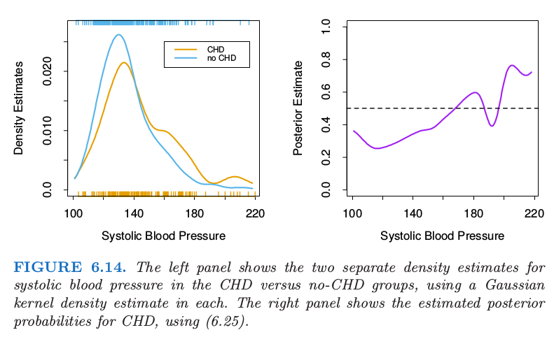
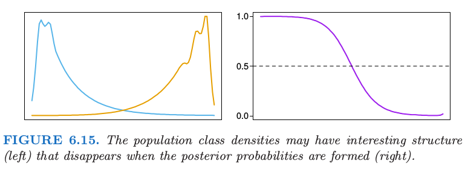

# 6.6 核密度估计和分类

| 原文   | [The Elements of Statistical Learning](../book/The Elements of Statistical Learning.pdf#page=227) |
| ---- | ---------------------------------------- |
| 翻译   | szcf-weiya                               |
| 时间   | 2017-03-04                    |
|更新|2019-04-16 21:01:35|
| 状态 | Done|

核密度估计是非监督学习过程，在历史上先于核回归。它还自然地导出了非参分类的一系列简单的过程。

## 核密度估计

假设我们从概率密度 $f_X(x)$ 中取随机样本 $x_1,x_2,\ldots,x_N$，并且希望估计 $x_0$ 处的 $f_X$。为了简化，我们现在假设 $X\in \IR$。与前面一样，一个自然的局部估计有如下形式

$$
\hat f_X(x_0)=\frac{\#x_i\in \cal N(x_0)}{N\lambda}\tag{6.21}
$$

其中 $\cal N(x_0)$ 为 $x_0$ 附近的宽度为 $\lambda$ 的很小的邻域。这个估计非常振荡，所以更倾向于使用光滑的 Parzen 估计
$$
\hat f(x_0)=\frac{1}{N\lambda}\sum\limits_{i=1}^NK_\lambda(x_0,x_i)\tag{6.22}\label{6.22}
$$
因为它考虑离 $x_0$ 近的观测点，并且观测点的权重系数随着离 $x_0$ 的距离增大而减小。这种情形下 $K_\lambda$ 受欢迎的选择是高斯核 $K_\lambda(x_0,x)=\phi(\vert x-x_0\vert/\lambda)$。图 6.13 显示了根据 CHD 群中 `systolic blood pressure` 的样本值来拟合高斯核密度。令 $\phi_\lambda$ 是均值为 0 标准误差为 $\lambda$ 的高斯密度，则 \eqref{6.22} 有如下形式
$$
\begin{align}
\hat f_X(x)& = \frac{1}{N}\sum\limits_{i=1}^N\phi_\lambda(x-x_i)\notag\\
&=(\hat F\star\phi_\lambda)(x)\qquad\tag{6.23}\label{6.23}
\end{align}
$$

这是经验分布函数 $\hat F$ 和 $\phi_\lambda$ 的卷积。

!!! note "weiya 注："
    按照[卷积](https://en.wikipedia.org/wiki/Convolution)的定义，
    $$
    (\hat F\star\phi_\lambda)(x) = \sum_{i=1}^n \hat F(x_i)\phi_\lambda(x-x_i) = \frac 1N \sum_{i=1}^n \phi_\lambda(x-x_i)\,.
    $$

分布函数 $\hat F(x)$ 在每个观测 $x_i$ 处赋予 $1/N$ 的权重，并且是跳跃的；在 $\hat f_X(x)$ 中我们已经对每个观测 $x_i$ 加上独立高斯噪声来光滑 $\hat F$.

Parzen 密度估计是局部平均的等价，并且根据局部回归提出了改进【在密度的对数尺度下；见 Loader (1999)[^1]】。我们这里不继续讨论这些。在$\IR^p$中，高斯密度的自然推广意味着在 \eqref{6.23} 中使用高斯积的核，

$$
\hat f_X(x_0)=\frac{1}{N(2\lambda^2\pi)^{p/2}}\sum\limits_{i=1}^Ne^{-\frac{1}{2}(\Vert x_i-x_0\Vert/\lambda)^2}\tag{6.24}
$$

[^1]: Loader, C. (1999). Local Regression and Likelihood, Springer, New York.

!!! tip "weiya 注："
    分享一篇介绍 Python 实现核密度估计的[博客](https://jakevdp.github.io/blog/2013/12/01/kernel-density-estimation/)。

## 核密度分类

利用贝叶斯定理可以直接地对分类做非参数密度估计。假设对于 $J$ 分类问题，我们对每个类别单独拟合非参密度估计 $\hat f_j(X),j=1,\ldots,J$，并且我们有类别先验概率 $\hat \pi_j$ 的估计（通常是样本比例）。则
$$
\widehat{\Pr}(G=j\mid X=x_0)=\frac{\hat \pi_j\hat f_j(x_0)}{\sum_{k=1}^J\hat\pi_k\hat f_k(x_0)}\tag{6.25}
$$

图 6.14 将这个方法应用在心脏风险因子研究中估计 CHD 的患病率中，并且应该与图 6.12 的左图进行比较。主要的差异出现在图 6.14 中右图的高 SBP 区域。这个区域中对于两个类别的数据都是稀疏的，并且因为高斯核密度估计采用度量核，所以密度估计在其他区域中效果很差（高方差）。局部逻辑斯蒂回归方法（6.20）采用 $k$-NN 带宽的三次立方核；这有效地拓宽了这个区域中的核，并且利用局部线性假设来对估计进行光滑（在逻辑斯蒂尺度上）。

> 左图显示了在 CHD 和 no-CHD 群体中 systolic blood pressure 的两个独立的密度估计，每个都采用高斯核估计。右图显示了用（6.25）估计的CHD的后验概率。

如果分类是最终的目标，则将单独的类别密度学得很好可能不是必要的，并且可以实际上有误导。图 6.15 显示了密度都是 **多模的 (multimodal)** 的例子，但是后验比例非常光滑。从数据中学习单独的密度，可能考虑设置一个更粗糙，高方差的拟合来捕捉这些特征，这与估计后验概率的目的是不相关的。实际上，如果分类是最终目标，我们仅仅需要估计在判别边界附近的后验（对于两个类别，这也就是集合 $\\{x\mid \Pr(G=1\mid X=x)=\frac{1}{2}\\}$）

> 总体类别的密度可能会有有趣的结构（左图），但是这种结构会在后验概率中消失（右图）。

## 朴素贝叶斯分类器

不管它的名字（也称为“白痴的贝叶斯”！），这是这些年仍然流行的技巧。当特征空间的维数 $p$ 很高，这种方式特别合适，使得密度估计不再吸引人。朴素贝叶斯模型假设给定类别 $G=j$，特征 $X_k$ 是独立的:

$$
f_j(X)=\prod\limits_{k=1}^pf_{jk}(X_k)\tag{6.26}\label{6.26}
$$

尽管这个假设一般是不对的，但是确实很大程度上简化了估计：

- 单独的类别条件的边缘密度 $f_{jk}$ 可以采用一维核密度估计分别估计出来。这实际上是原始朴素贝叶斯过程的泛化，采用单变量高斯分布来表示这些边缘密度。
- 如果 $X$ 的组分 $X_j$ 是离散的，则可以使用合适的直方图估计。这提供了在特征向量中混合变量类型的完美方式。

尽管这些假设过于乐观，朴素贝叶斯分类器经常比更复杂的分类器做得更好。原因与图 6.15 相关：尽管单独的类别密度估计可能是有偏的，但这个偏差或许不会对后验概率不会有太大的影响，特别是在判别区域附近。实际上，这个问题或许可以承受为了节省方差造成的相当大的偏差，比如“天真的”假设得到的。

从 \eqref{6.26} 开始我们可以导出逻辑斯蒂变换（采用类别 $J$ 作为基底）：

$$
\begin{align*}
\log\frac{\Pr(G=\ell\mid X)}{\Pr(G=J\mid X)}&=\log\frac{\pi_\ell f_\ell(X)}{\pi_Jf_J(X)}\\
&=\log\frac{\pi_\ell\prod_{k=1}^pf_{\ell k}(X_k)}{\pi_J\prod_{k=1}^pf_{Jk}(X_k)}\\
&=\log\frac{\pi_\ell}{\pi_J}+\sum\limits_{k=1}^p\log\frac{f_{\ell k}(X_k)}{f_{Jk}(X_k)}\\
&=\alpha_\ell + \sum\limits_{k=1}^pg_{\ell k}(X_k)
\end{align*}
\tag{6.27}
$$

这有广义加性模型的形式，更多细节将在 [第 9 章](../09-Additive-Models-Trees-and-Related-Methods/9.0-Introduction/index.html) 中描述。尽管模型以完全不同的方式来拟合；它们的差别将在[练习 6.9 ](https://github.com/szcf-weiya/ESL-CN/issues/188)中探索。

!!! info "weiya 注：Ex. 6.9"
    已解决，详见 [Issue 188: Ex. 6.9](https://github.com/szcf-weiya/ESL-CN/issues/188)，欢迎交流讨论！

朴素贝叶斯和广义加性模型间的关系可以类比成线性判别分析和逻辑斯蒂回归（[4.4.5 节](../04-Linear-Methods-for-Classification/4.4-Logistic-Regression/index.html#lda)）。

!!! note "weiya 注："
    附上一个用朴素贝叶斯做文本分析的例子，[垃圾短信分类](https://github.com/szcf-weiya/ESL-CN/tree/master/code/NaiveBayes)。
