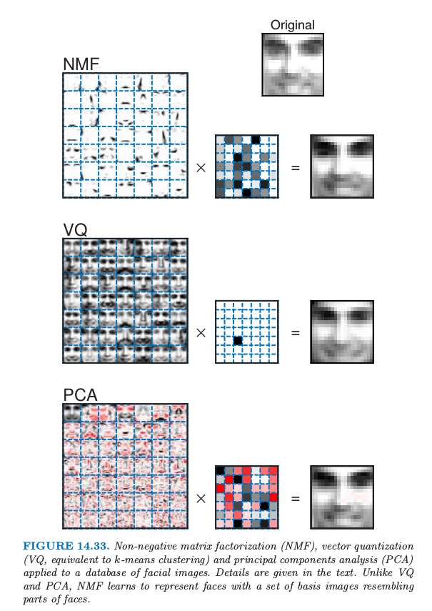
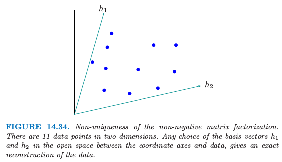
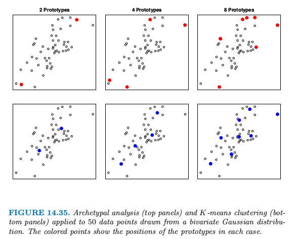
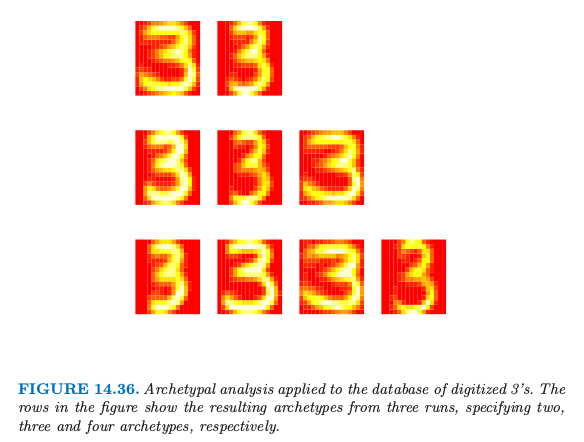

# 14.6 非负矩阵分解

| 原文   | [The Elements of Statistical Learning](../book/The Elements of Statistical Learning.pdf) |
| ---- | ---------------------------------------- |
| 翻译   | szcf-weiya                               |
| 时间   | 2017-09-03                   |
|更新|2018-03-10|
|状态|Done|

**非负矩阵分解** (Lee and Seung, 1999)[^1]是最近提出来的一个用来替代主成分分析的方法，在这个方法中数据以及成分假定为非负的。这对于建立非负数据的模型很有用，比如图象数据。

$N\times p$ 数据矩阵 $\mathbf X$ 由下式近似

$$
\mathbf X \approx \mathbf W\mathbf H\tag{14.72}
$$

其中 $\mathbf W$ 阶为 $N\times r$，$\mathbf H$ 阶为 $r\times p, r\le \max(N,p)$。我们假设 $x_{ij}, w_{ik}, h_{kj}\ge 0$。

通过最大化下式来确定 $\mathbf W$ 和 $\mathbf H$

$$
L(\mathbf W, \mathbf H)=\sum\limits_{i=1}^N\sum\limits_{j=1}^p[x_{ij}\log(\mathbf {WH})_{ij}-(\mathbf{WH})_{ij})]\tag{14.73}
$$

这是模型的对数似然，模型中 $x_{ij}$ 服从均值为 $(\mathbf{WH})_{ij}$ 的 Poisson 分布——这对于正值数据是很合理的。

下面的轮换 (alternating) 算法 (Lee and Seung, 2001)[^2] 收敛到 $L(\mathbf W, \mathbf H)$ 的局部最大值：

<!-- 
$$
\begin{array}{ll}
w_{ik}&\leftarrow w_{ik}\frac{\sum_{j=1}^ph_{kj}x_{ij}/(\mathbf{WH}_{ij})}{\sum_{j=1}^ph_{kj}}\\
h_{kj}&\leftarrow h_{kj}\frac{\sum_{j=1}^pw_{ik}x_{ij}/(\mathbf{WH}_{ij})}{\sum_{j=1}^pw_{ik}}
\end{array}\tag{14.74}
$$
-->

$$
\begin{align}
w_{ik}&\leftarrow w_{ik}\frac{\sum_{j=1}^ph_{kj}x_{ij}/(\mathbf{WH})_{ij}}{\sum_{j=1}^ph_{kj}}\\
h_{kj}&\leftarrow h_{kj}\frac{\sum_{i=1}^Nw_{ik}x_{ij}/(\mathbf{WH})_{ij}}{\sum_{i=1}^Nw_{ik}}
\end{align}\tag{14.74}
$$

这个算法可以由最大化 $L(\mathbf W, \mathbf H)$ 的 **minorization** 过程来导出（[练习14.23](https://github.com/szcf-weiya/ESL-CN/issues/86)）

!!! info "weiya 注：Ex. 14.23"
    练习 14.23 已解答，详细过程参见 [Issue 86: Ex. 14.23](https://github.com/szcf-weiya/ESL-CN/issues/86)

!!! note "weiya 注：minorization"
    [练习 14.23](https://github.com/szcf-weiya/ESL-CN/issues/86)中介绍了 minorization 的概念。对于函数$g(x, y)$和$f(x)$，若对于定义域中所有的 $x$ 和 $y$，若满足
    $$
    g(x,y)\le f(x),\qquad g(x,x)=f(x)
    $$
    则称$g(x,y)$ minorize $f(x)$。

并且与对数线性模型的 **迭代比例缩放算法 (iterative-proportional-scaling algorithm)** 相关（[练习 14.24](https://github.com/szcf-weiya/ESL-CN/issues/87)）。

!!! info "weiya 注：Ex. 14.24"
    练习 14.24 已解答，详细过程参见 [Issue 87: Ex. 14.24](https://github.com/szcf-weiya/ESL-CN/issues/87)

图 14.33 展示了从 Lee and Seung (1999) 中选取的例子，其中比较了非负矩阵分解 (NMF)，向量量化（VQ，等价于 $k$ 均值聚类）以及主成分分析 (PCA)。将这三种学习方法应用到大小为 $N=2429$ 的人脸数据库中，每个包含 $19\times 19$的像素点，得到一个 $2429\times 381$的矩阵 $\X$。如 $7\times 7$ 个蒙太奇画（每个都是 $19\times 19$ 的图象）所示，每种方法学习 $r=49$ 张基图象集。正值用黑色像素表示，而负值用红色像素点表示。对于一张特定的脸，如右上角所示，用基图象的线性叠加来近似。线性叠加的系数在$7\times 7$数组中的每个蒙太奇画的右边，最终得到的叠加图像显示在等式右边。作者指出，与 VQ 和 PCA 不同，NMF 是用表示脸的不同部位的基图象来学习去表征脸。

Donoho and Stodden (2004)[^3] 指出非负矩阵分解的一个潜在的严重问题。即使在 $\X=\W\H$严格成立的情形下，分解可能不是唯一的。图 14.34 说明了这个问题。

数据点落在 $p=2$ 维空间中，并且数据与坐标轴之间存在开放的区域 (open space)。我们可以在这个开放区域中选择基向量 $h_1$ 和 $h_2$，并且用这些向量的非负线性组合来精确表示每个数据点。这个不唯一性表明上述的算法得到的解会依赖初始值，并且似乎阻碍了因子分解的解释性。尽管这个解释性方面的不足，非负矩阵分解及其应用吸引力许多研究者的兴趣。

## 原型分析

归功于 Cutler and Breiman (1994)[^4]，这个方法通过原型（数据点的线性组合）来近似数据点。在这个意义上，与 $K$ 均值聚类有相似的地方。然而，不是用单个附近的原型来近似每个数据点，原型分析通过一系列原型的凸组合来近似每个数据点。凸组合的使用强制原型位于数据云的凸壳 (convex hull) 上。在这个意义下，原型是纯的 (pure)，或典型的 (archetypal)。

如 (17.42) 一样，$N\times p$的数据矩阵 $\X$ 建模为

$$
\X\approx \W\H\tag{14.75}
$$

其中 $\W$ 阶为 $N\times r$，且 $\H$ 为 $r\times p$。我们假设$w_{ik}\ge 0$，且 $\sum_{k=1}^rw_{ik}=1\;\forall i$。因此 $p$维空间中的 $N$ 个数据点（$\X$的行）用 $r$ 个原型（$\H$的行）的凸组合来表示。我们还假设

$$
\H=\B\X\tag{14.76}
$$

其中 $\B$ 阶为 $r\times N$，其中 $b_{ki}\ge 0$，且 $\sum_{i=1}^Nb_{ki}=1\forall k$。因此原型本身是数据点的凸组合。使用 (14.75) 和 (14.76)，我们对下式关于权重$\W$和$\B$最小化

$$
\begin{align}
J(\W, \B) & = \Vert \X-\W\H\Vert^2\\
&=\Vert \X-\W\B\X\Vert^2\tag{14.77}
\end{align}
$$

我们采用轮换的模式对函数进行最小化，其中每个单独的最小化都涉及到凸优化。然而整个问题不是凸的，所以算法收敛到准则的一个局部最小值点。

图 14.35 展示了二维中模拟数据的例子。上面板展示了 $K$ 均值聚类的结果。为了从原型的凸组合中重构出数据，需要在数据的凸壳上定位原型。可以在图14.35的上图中看到，并且一般地是这种情形，如Cutler and Breiman (1994)[^4]所证明的那样。如图中下面板所示，$K$ 均值聚类在数据云的中间选择原型。

我们可以把 $K$ 均值聚类看成原型模型的特殊情形，其中 $\W$ 的每一行有一个元素取 1，其余取 0。

注意到原型模型 (14.75) 与非负矩阵分解模型 (14.72) 有相同的一般形式。然而，这两个模型应用在不同的条件中，并且目标也不太相同。非负矩阵分解目的是近似数据矩阵 $\X$ 的列，并且主要感兴趣的是 $\W$ 的列，它表示了数据中主要的非负组分。原型分析而是关注用 $\H$ 的行（表示了原型数据点）来近似 $\X$ 的行。非负矩阵分解还假设 $r\le p$。当 $r=p$，简单将 $\W$ 选为 列经过缩放（所以加起来和为1）的 $\X$，可以得到精确的重构。相反，原型分析要求 $r\le N$，但允许 $r>p$。举个例子，在图 14.35 中，$p=2,N=50$，而$r=2,4,8$。额外的约束 (14.76) 表明典型分析不是完美的，即使 $r>p$。

图 14.36 展示了将典型分析应用于图 14.22 中的 3 的数据集的结果。图 14.36 中的三行是取自三次原型分析的结果，分别是 2 个原型、3 个原型和 4 个原型。和预想一样，该算法得到了大小和形状上都极端的 3。

[^1]: Lee, D. and Seung, H. (1999). Learning the parts of objects by non-negative matrix factorization, Nature 401: 788.
[^2]: Lee, D. and Seung, H. (2001). Algorithms for non-negative matrix factorization, Advances in Neural Information Processing Systems, (NIPS 2001), Vol. 13, Morgan Kaufman, Denver., pp. 556–562.
[^3]: Donoho, D. and Stodden, V. (2004). When does non-negative matrix factorization give a correct decomposition into parts?, in S. Thrun, L. Saul and B. Sch¨olkopf (eds), Advances in Neural Information Processing Systems 16, MIT Press, Cambridge, MA.
[^4]: Cutler, A. and Breiman, L. (1994). Archetypal analysis, Technometrics 36(4): 338–347.

