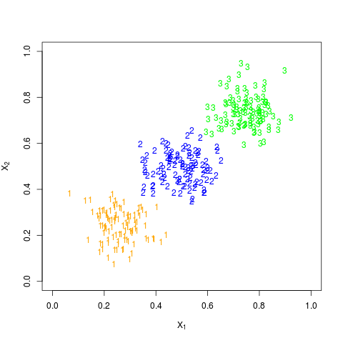
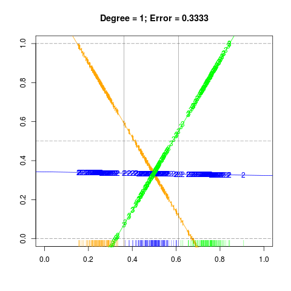
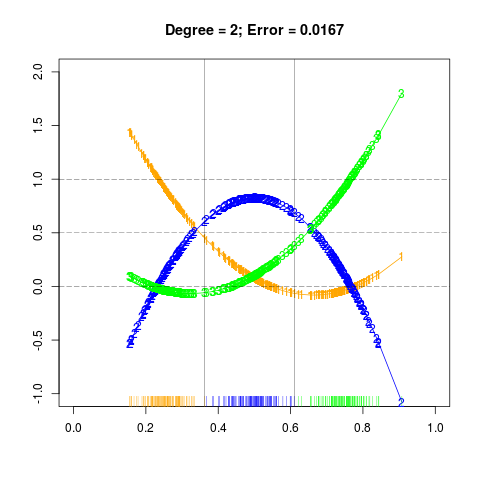

# 模拟：Fig. 4.3

| 正文 | [4.3 线性判别分析](../../04-Linear-Methods-for-Classification/4.2-Linear-Regression-of-an-Indicator-Matrix/index.html) |
| ---- | ---------------------------------------- |
| 作者   | szcf-weiya                               |
| 时间   | 2018-07-11                               |

## 生成数据

根据 Fig. 4.2 知，我们需要生成三个类别的数据，于是采用下面代码生成了均值不同，协方差相同的多元正态随机变量，

```r
mu = c(0.25, 0.5, 0.75)
sigma = 0.005*matrix(c(1, 0,
                 0, 1), 2, 2)
library(MASS)
set.seed(1650)
N = 100
X1 = mvrnorm(n = N, c(mu[1], mu[1]), Sigma = sigma)
X2 = mvrnorm(n = N, c(mu[2], mu[2]), Sigma = sigma)
X3 = mvrnorm(n = N, c(mu[3], mu[3]), Sigma = sigma)
X = rbind(X1, X2, X3)
```

分布图为



## 拟合

首先将生成的数据投射到三类数据点形心连线上，并且构造响应变量 $y$，然后分别拟合左右图，并以此进行分类，计算误差率，具体结果如下：

## 左图

```r
## project X onto the line joining the three centroids
X.proj = rowMeans(X) # if necessary, multiply sqrt 2
## fit as in figure 4.3
## consider orange
Y1 = c(rep(1, N), rep(0, N*2))
## blue
Y2 = c(rep(0, N), rep(1, N), rep(0, N))
## green
Y3 = c(rep(0, N), rep(0, N), rep(1, N))
## regression
m1 = lm(Y1~X.proj)
pred1 = as.numeric(fitted(m1)[order(X.proj)])
m2 = lm(Y2~X.proj)
pred2 = as.numeric(fitted(m2)[order(X.proj)])
m3 = lm(Y3~X.proj)
pred3 = as.numeric(fitted(m3)[order(X.proj)])
c1 = which(pred1 <= pred2)[1] 
c2 = min(which(pred3 > pred2)) 
# class 1: 1 ~ c1
# class 2: c1+1 ~ c2
# class 3: c2+1 ~ end
# actually, c1 = c2
err1 = (abs(c2 - 2*N) + abs(c1 - N))/(3*N)

## reproduce figure 4.3 left
png("reproduce-fig-4-3l.png")
plot(0, 0, type = "n", 
     xlim = c(0, 1), ylim = c(0,1), xlab = "", ylab = "",
     main = paste0("Degree = 1; Error = ", round(err1, digits = 4)))
abline(coef(m1), col = "orange")
abline(coef(m2), col = "blue")
abline(coef(m3), col = "green")
points(X.proj, fitted(m1), pch="1", col="orange")
points(X.proj, fitted(m2), pch = "2", col = "blue")
points(X.proj, fitted(m3), pch = "3", col = "green")
rug(X.proj[1:N], col = "orange")
rug(X.proj[(N+1):(2*N)], col = "blue")
rug(X.proj[(2*N+1):(3*N)], col = "green")
abline(h=c(0.0, 0.5, 1.0), lty=5, lwd = 0.4)
abline(v=c(sort(X.proj)[N], sort(X.proj)[N*2]), lwd = 0.4)
dev.off()
```



## 右图

```r
## polynomial regression
pm1 = lm(Y1~X.proj+I(X.proj^2))
pm2 = lm(Y2~X.proj+I(X.proj^2))
pm3 = lm(Y3~X.proj+I(X.proj^2))
## error rate for figure 4.3 right
pred21 = as.numeric(fitted(pm1)[order(X.proj)])
pred22 = as.numeric(fitted(pm2)[order(X.proj)])
pred23 = as.numeric(fitted(pm3)[order(X.proj)])
c1 = which(pred21 <= pred22)[1] - 1
c2 = max(which(pred23 <= pred22)) 
# class 1: 1 ~ c1
# class 2: c1+1 ~ c2
# class 3: c2+1 ~ end
err2 = (abs(c2 - 2*N) + abs(c1 - N))/(3*N)

## reproduce figure 4.3 right
png("reproduce-fig-4-3r.png")
plot(0, 0, type = "n", 
     xlim = c(0, 1), ylim = c(-1,2), xlab = "", ylab = "",
     main = paste0("Degree = 2; Error = ", round(err2, digits = 4)))
lines(sort(X.proj), fitted(pm1)[order(X.proj)], col="orange", type = "o", pch = "1")
lines(sort(X.proj), fitted(pm2)[order(X.proj)], col="blue", type = "o", pch = "2")
lines(sort(X.proj), fitted(pm3)[order(X.proj)], col="green", type = "o", pch = "3")
abline(h=c(0.0, 0.5, 1.0), lty=5, lwd = 0.4)
## add rug
rug(X.proj[1:N], col = "orange")
rug(X.proj[(N+1):(2*N)], col = "blue")
rug(X.proj[(2*N+1):(3*N)], col = "green")
abline(v=c(sort(X.proj)[N], sort(X.proj)[N*2]), lwd = 0.4)
dev.off()
```



完整代码参见 [Github](https://github.com/szcf-weiya/ESL-CN/tree/master/docs/notes/LDA/sim-fig-4-2.R)

