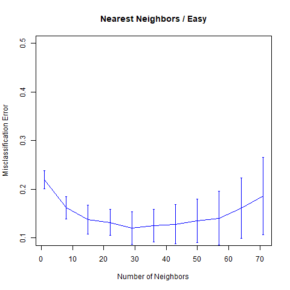
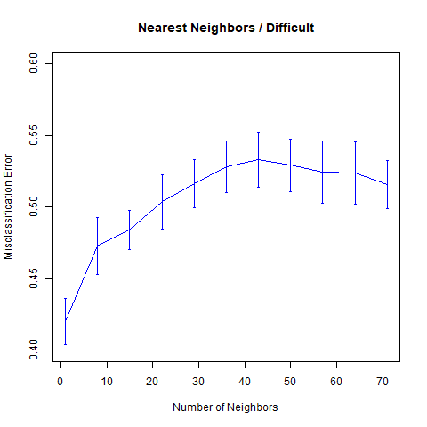
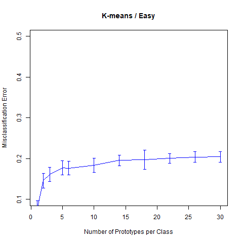
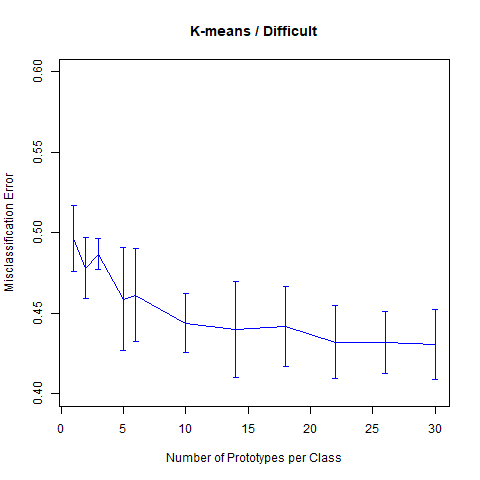

# 模拟：Fig. 13.5

| R Notebook   | [模拟：Fig. 13.5](http://rmd.hohoweiya.xyz/sim13_5.html) |
| ---- | ---------------------------------------- |
| 作者   | szcf-weiya                               |
| 时间   | 2018-02-04                               |

## 问题重述

对于Easy Problem，
$$
Y = I(X_1\ge \frac 12)
$$

对于Difficult Problem，

$$
Y=I(\mathrm{sign}\Big\{\prod\limits_{j=1}^3(X_j-\frac 12)\Big\}>0)
$$

本模拟实验比较了k最近邻和k均值应用在上述两个问题的分类误差率随相应参数变化的曲线，结果表明与书中图13.5完美契合。


## 生成数据

```R
## generate dataset X
genX <- function(N, p = 10){
  sapply(1:p, function(i) runif(N))
}
## generate dataset Y
genY <- function(X, id = 1){
  if (id == 1){
    apply(X, 1, function(x) ifelse(x[1] < 0.5, 0, 1) )
  }
  else if (id == 2){
    apply(X, 1, function(x) ifelse(prod(x[1:3]-0.5) > 0, 1, 0) )
  }
  else{
    cat("WARNING! Incorrect id for problems.")
  }
}
```

## 参数设定

```R
n.train = 100
n.test = 1000
n.realization = 10
```

## k最近邻

```R
library(class)
seq.knn = seq(1, 71, by = 7)
n.knn = length(seq.knn)
err = array(NA, c(n.knn, n.realization))
```

编写在两个问题中k最近邻的模拟函数`knn.sim()`

```R
knn.sim <- function(id){
  for (j in 1:n.realization){
    X.train = genX(n.train)
    Y.train = genY(X.train, id)
    X.test = genX(n.test)
    Y.test = genY(X.test, id)
    for (i in 1:n.knn){
      Y.pred = knn(X.train, X.test, factor(Y.train), k = seq.knn[i])
      err[i, j] = sum(Y.pred!=Y.test)/n.test
    }
  }
  return(err)
}
```

编写整个模拟实验中通用的绘图函数`myplot()`

```R
myplot <- function(seq.knn, err, main, xlab, ylim){
  ## calculate the mean and std of misclassification error
  err.mean = apply(err, 1, mean)
  err.std = apply(err, 1, sd)

  n.knn = length(seq.knn)
  ## plot
  plot(seq.knn, err.mean,
       main = main,
       ylab = "Misclassification Error",
       xlab = xlab,
       col = "blue", type = "l",
       ylim = ylim)
  for(i in 1:n.knn){
    lines(c(seq.knn[i], seq.knn[i]),
          c(err.mean[i] - err.std[i], err.mean[i] + err.std[i]),
          col = "blue", pch = 3)
    lines(c(seq.knn[i]-0.2, seq.knn[i]+0.2),
          c(err.mean[i] - err.std[i], err.mean[i] - err.std[i]),
          col = "blue", pch = 3)
    lines(c(seq.knn[i]-0.2, seq.knn[i]+0.2),
          c(err.mean[i] + err.std[i], err.mean[i] + err.std[i]),
          col = "blue", pch = 3)
  }
}
```

则Easy Problem的分类误差随邻居数变化的曲线为

```R
err = knn.sim(1)
myplot(seq.knn, err, "Nearest Neighbors / Easy", "Number of Neighbors", c(0.1, 0.5))
```



对于Difficult Problem，我们有

```R
err = knn.sim(2)
myplot(seq.knn, err, "Nearest Neighbors / Difficult", "Number of Neighbors", c(0.4, 0.6))
```



## k-means聚类

```R
seq.kmeans = c(1, 2, 3, 5, seq(6, 31, by = 4))
n.kmeans = length(seq.kmeans)
err = array(NA, c(n.kmeans, n.realization))
```

编写两个问题中k-means的模拟函数`kmeans.sim()`

```R
## predict function for k-means
predict.kmeans <- function(cl0, cl1, newpoint){
  center0 = cl0$centers
  center1 = cl1$centers
  res0 = apply(newpoint, 1, function(x) {
    min(apply(center0, 1, function(xx) sum((xx-x)^2)))
  })
  res1 = apply(newpoint, 1, function(x) {
    min(apply(center1, 1, function(xx) sum((xx-x)^2)))
  })
  ifelse(res0 < res1, 0, 1)
}
kmeans.sim <- function(id){
  for (j in 1:n.realization){
    X.train = genX(n.train)
    Y.train = genY(X.train, id)
    X.test = genX(n.test)
    Y.test = genY(X.test, id)
    for (i in 1:n.kmeans){
      cl0 = kmeans(X.train[Y.train==0, ], seq.kmeans[i])
      cl1 = kmeans(X.train[Y.train==1, ], seq.kmeans[i])
      Y.pred = predict.kmeans(cl0, cl1, X.test)
      err[i, j] = sum(Y.pred!=Y.test)/n.test
    }
  }
  return(err)
}
```

则Easy Problem的分类误差随原型个数变化的曲线为

```R
err = kmeans.sim(1)
myplot(seq.kmeans, err, "K-means / Easy", "Number of Prototypes per Class", c(0.1, 0.5))
```



而Difficult Problem对应的图象为

```R
err = kmeans.sim(2)
myplot(seq.kmeans, err, "K-means / Difficult", "Number of Prototypes per Class", c(0.4, 0.6))
```



## 待解决的问题

- 为什么贝叶斯误差率为0.
- 加入LVQ
