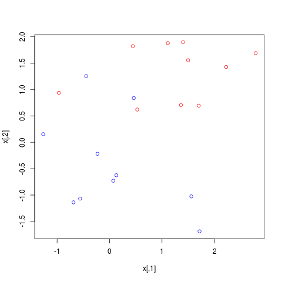
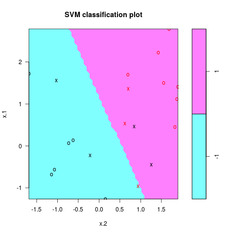
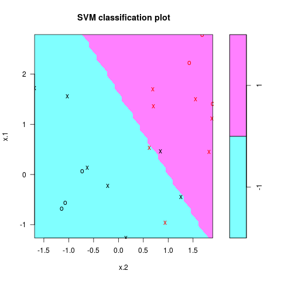
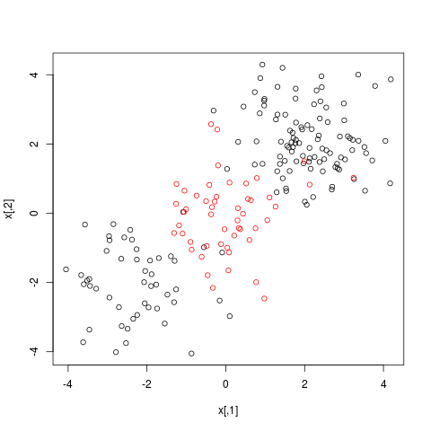
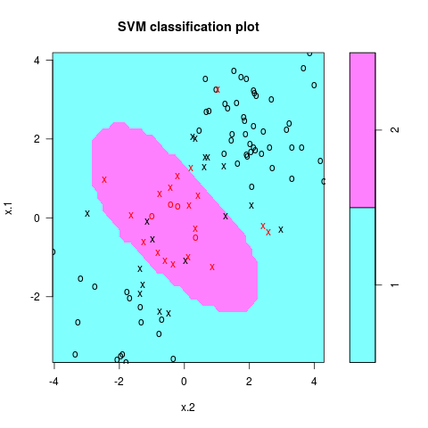
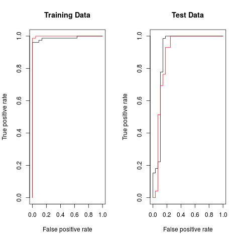
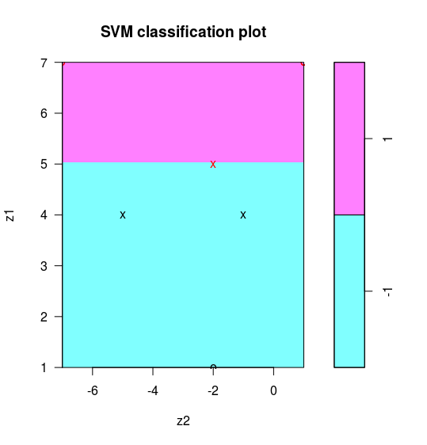
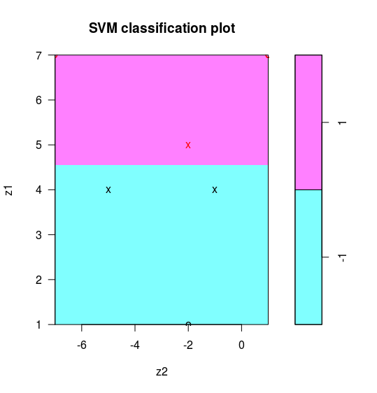
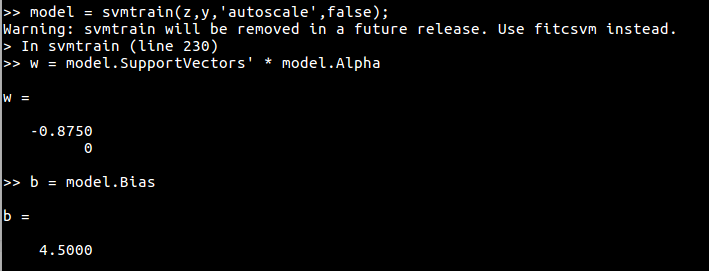
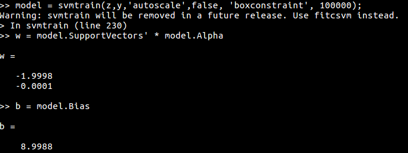

# SVM处理线性和非线性类别边界

| Stats Blog   | [Illustrations of Support Vector Machines](https://stats.hohoweiya.xyz//2017/05/18/Support-Vector-Classifier/) |
| ---- | ---------------------------------------- |
| 作者   | szcf-weiya                               |
| 时间   | 2018-02-12                               |
| 更新   | 2018-03-19                               |


通过两个例子，介绍如何使用`e1071`包SVM进行分类，主要参考ISLR[^1]。

## 线性类别边界

### 生成数据

```r
## generate data
set.seed(123)
x = matrix(rnorm(20*2), ncol = 2)
y = c(rep(-1, 10), rep(1, 10))
x[y==1, ] = x[y==1, ] + 1
png("ex1.png")
plot(x, col = (3-y))
dev.off()
```




### 拟合

应用支持向量分类器

```r
dat = data.frame(x = x, y = as.factor(y))
svmfit = svm(y~., data = dat, kernel = "linear", cost = 10, scale = FALSE)
png("ex1_svm.png")
plot(svmfit, dat)
dev.off()
```

分类结果如图所示



注意到参数`cost`越大，margin越窄，当变小`cost`时，支持向量的个数也会增多

!!! tip
    `svmfit$index`返回支持向量的序号。

```r
## a smaller cost
svmfit = svm(y~., data = dat, kernel = "linear", cost = 0.1, scale = FALSE)
png("ex1_svm_smaller.png")
plot(svmfit, dat)
dev.off()
```



### 交叉验证

当然也可以通过交叉验证选择最优的`cost`

```r
## cross-validation
set.seed(123)
tune.out = tune(svm, y~., data = dat, kernel="linear", ranges = list(cost=c(0.001, 0.01, 0.1, 1, 5, 10, 100)))
summary(tune.out)

## pick up the best model
bestmod = tune.out$best.model
summary(bestmod)
```

输出结果如下：

```r
# Call:
#   best.tune(method = svm, train.x = y ~ ., data = dat, ranges = list(cost = c(0.001, 
#                                                                               0.01, 0.1, 1, 5, 10, 100)), kernel = "linear")
# 
# 
# Parameters:
#   SVM-Type:  C-classification 
# SVM-Kernel:  linear 
# cost:  1 
# gamma:  0.5 
# 
# Number of Support Vectors:  8
# 
# ( 4 4 )
# 
# 
# Number of Classes:  2 
# 
# Levels: 
#   -1 1
```

### 预测

应用通过交叉验证选择出的最优模型进行预测

```r
## prediction
xtest = matrix(rnorm(20*2), ncol = 2)
ytest = sample(c(-1, 1), 20, rep = TRUE)
xtest[ytest == 1, ] = xtest[ytest == 1, ] + 1
testdat = data.frame(x = xtest, y = as.factor(ytest))
ypred = predict(bestmod, testdat)
table(predict = ypred, truth = testdat$y)
```


预测结果为
```r
#        truth
# predict -1 1
#      -1  8 2
#      1   1 9
```

## 非线性类别边界

### 生成数据

```r
set.seed(123)
x = matrix(rnorm(200*2), ncol = 2)
x[1:100, ] = x[1:100, ] + 2
x[101:150, ] = x[101:150, ] - 2
y = c(rep(1, 150), rep(2, 50))
dat = data.frame(x = x, y = as.factor(y))
png("ex2.png")
plot(x, col = y)
dev.off()
```



### 训练

```r
## randomly split into training and testing groups
train = sample(200, 100)

## training data using radial kernel
svmfit = svm(y~., data = dat[train, ], kernel = "radial", cost = 1)
png("ex2_svm.png")
plot(svmfit, dat[train, ])
dev.off()
```



### 交叉验证

采用交叉验证选择最优的模型，注意`radial`核有两个调整参数，`gamma`和`cost`。

```r
## cross-validation 
set.seed(123)
tune.out = tune(svm, y~., data = dat[train, ], kernel = "radial",
                ranges = list(cost = c(0.1, 1, 10, 100, 1000),
                              gamma = c(0.5, 1, 2, 3, 4)))
summary(tune.out)
```

结果如下

```r
# Parameter tuning of ‘svm’:
#   
#   - sampling method: 10-fold cross validation 
# 
# - best parameters:
#   cost gamma
# 10     3
# 
# - best performance: 0.08 
# 
# - Detailed performance results:
#   cost gamma error dispersion
# 1  1e-01   0.5  0.22 0.10327956
# 2  1e+00   0.5  0.11 0.08755950
# 3  1e+01   0.5  0.09 0.05676462
# 4  1e+02   0.5  0.11 0.08755950
# 5  1e+03   0.5  0.10 0.08164966
# 6  1e-01   1.0  0.22 0.10327956
# 7  1e+00   1.0  0.11 0.08755950
# 8  1e+01   1.0  0.10 0.08164966
# 9  1e+02   1.0  0.09 0.07378648
# 10 1e+03   1.0  0.13 0.08232726
# 11 1e-01   2.0  0.22 0.10327956
# 12 1e+00   2.0  0.12 0.09189366
# 13 1e+01   2.0  0.11 0.07378648
# 14 1e+02   2.0  0.12 0.06324555
# 15 1e+03   2.0  0.16 0.08432740
# 16 1e-01   3.0  0.22 0.10327956
# 17 1e+00   3.0  0.13 0.09486833
# 18 1e+01   3.0  0.08 0.07888106
# 19 1e+02   3.0  0.14 0.06992059
# 20 1e+03   3.0  0.16 0.08432740
# 21 1e-01   4.0  0.22 0.10327956
# 22 1e+00   4.0  0.12 0.09189366
# 23 1e+01   4.0  0.09 0.07378648
# 24 1e+02   4.0  0.13 0.06749486
# 25 1e+03   4.0  0.17 0.11595018
```

### 预测

采用上述交叉验证得到的最优模型进行预测

```r
## prediction
table(true = dat[-train, "y"], pred = predict(tune.out$best.model, newdata = dat[-train, ]))
```

结果为

```r
#       pred
# true  1  2
#    1 72  0
#    2  6 22
```

### ROC曲线

采用ROC曲线来衡量分类模型效果。`ROCR`包可以用来生成ROC曲线。首先自定义`rocplot`用于绘图

```r
## ROC curves
library(ROCR)
rocplot = function(pred, truth, ...) {
  if (mean(pred[truth==1]) > mean(pred[truth==2]))
    predob = prediction(pred, truth, label.ordering = c("2", "1"))
  else
    predob = prediction(pred, truth, label.ordering = c("1", "2"))
  perf = performance(predob , "tpr" , "fpr")
  plot(perf, ...) 
}
```

!!! note "weiya注"
    上述代码值得说明的是`prediction`函数中的`label.ordering`参数，具体用法参见help文档，初次调用时也被困惑了一时，详细过程参见[R | 技术博客](https://tech.hohoweiya.xyz/R/#rocrprediction)

训练集的ROC曲线

```r
svmfit.opt = svm(y~., data = dat[train, ], kernel = "radial",
                 gamma = 3, cost = 10, decision.values = T)
fitted = attributes(predict(svmfit.opt, dat[train, ], decision.values = T))$decision.values
png("roc.png")
par(mfrow = c(1, 2))
rocplot ( fitted , dat [ train ,"y"] , main ="Training Data")
```

增大`gamma`得到更flexible的模型，与最优的模型进行比较

```r
## increasing gamma to produce a more flexible fit
svmfit.flex = svm(y~. , data = dat [ train ,] , kernel = "radial", gamma =50 , cost =1 , decision.values = T )
fitted = attributes(predict(svmfit.flex, dat[train ,], decision.values = T ) ) $decision.values
rocplot(fitted, dat[train, "y"], add = T, col ="red")
```

画出这两个模型在测试集上的ROC曲线

```r
## on test data
fitted = attributes(predict(svmfit.opt, dat[-train, ], decision.values = T ) ) $decision.values
rocplot(fitted, dat[-train, "y"] , main = "Test Data")
fitted = attributes(predict(svmfit.flex, dat[-train, ], decision.values = T ) ) $decision.values
rocplot(fitted, dat[-train, "y"] , add =T, col ="red")
dev.off()
```



从图中容易看出，在训练数据上，flexible的模型ROC表现更好，而在测试集上最优模型表现最好。


## 计算边界

本节内容是知乎问题[MATLAB上libsvm的使用？ - 知乎](https://www.zhihu.com/question/269082342/answer/345343234)的回答过程。

虽然问题是问 Matlab，但系统上没装 matlab，而且不同语言中的算法应该是基本一致的。所以先用 R 来研究一下

数据生成代码

```r
x = matrix(c(1, 0,
             0, 1,
             0, -1,
             -1, 0,
             0, 2,
             0, -2,
             -2, 0), byrow = T, ncol = 2)
y = c(-1, -1, -1, 1, 1, 1, 1)
phi <- function(x){
  return(c(x[2]^2 - 2*x[1] + 3, x[1]^2 - 2*x[2] - 3))
}
z = t(apply(x, 1, phi))
df = data.frame(z, factor(y))
colnames(df) <- c("z1", "z2", "y")
```

注意要设定 `scale = FALSE`，当采用默认 `cost` 时，
```r
# cost = 1
svmfit = svm(y~., data = df, kernel="linear", scale = F,cost=1)
w = t(svmfit$coefs) %*% svmfit$SV
b = -svmfit$rho
w
b
```



此时线性边界为 $z_1=5$，不是问题中的最优分离超平面。注意到当 $C\rightarrow\infty$ 时会得到最优超平面，所以我们取个较大的 `cost` 进行训练，即

```r
# cost = 10000
svmfit = svm(y~., data = df, kernel="linear", scale = F,cost=1000000)
w = t(svmfit$coefs) %*% svmfit$SV
b = -svmfit$rho
w
b
```

得到



判别边界为 $-1.999808z_1-6.4\times 10^{-5}z_2+8.998997=0$，近似 $z_1=4.5$。

顺带贴一下 matlab 的结果





[^1]: [An Introduction to Statistical Learning with Applications in R](http://www.springer.com/gp/book/9781461471370) [备用下载](https://szcf-weiya.github.io/ISLRnotes/ISLR%20Sixth%20Printing.pdf)
